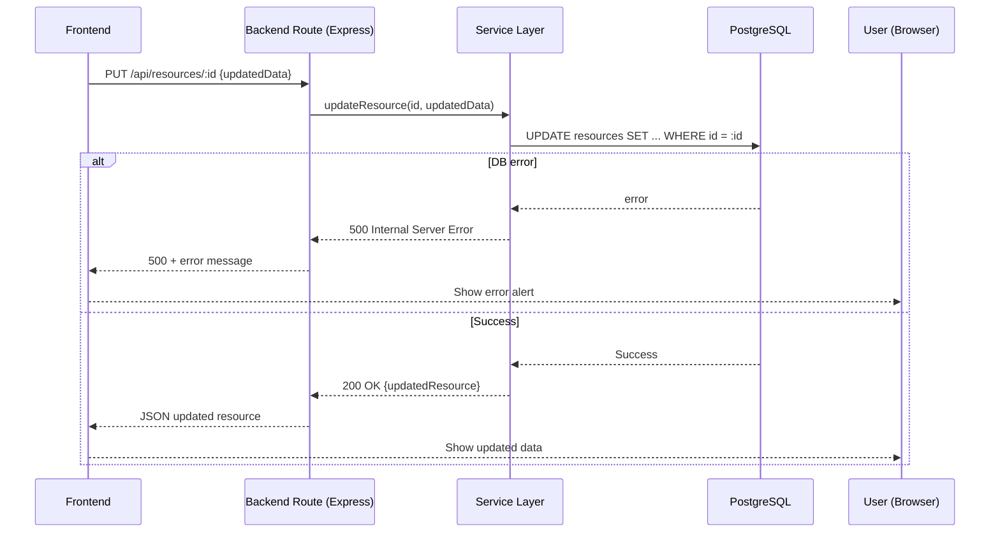
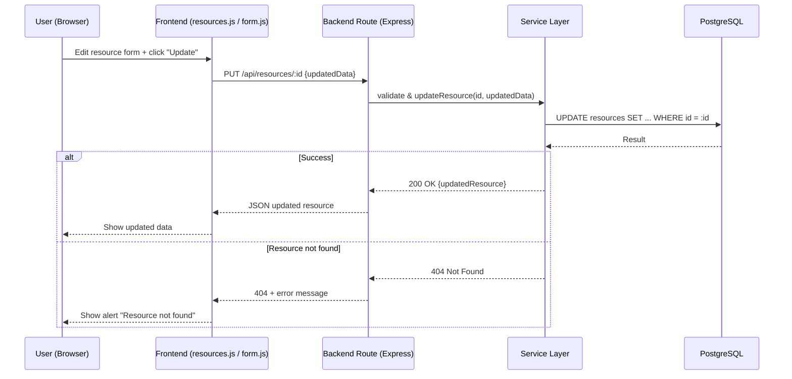

# READ



# UPDATE



# DELETE

```mermaid
sequenceDiagram
    participant User as User (Browser)
    participant FE as Frontend (resources.js / list.js)
    participant BE as Backend Route (Express)
    participant Service as Service Layer
    participant DB as PostgreSQL

    User->>FE: Click "Delete" on resource
    FE->>BE: DELETE /api/resources/:id
    BE->>Service: deleteResource(id)
    Service->>DB: DELETE FROM resources WHERE id = :id
    DB-->>Service: Result

    alt Success
        Service-->>BE: 204 No Content
        BE-->>FE: 204
        FE-->>User: Remove item from UI
    else Resource not found
        Service-->>BE: 404 Not Found
        BE-->>FE: 404 + error message
        FE-->>User: Show alert "Resource not found"
    end
